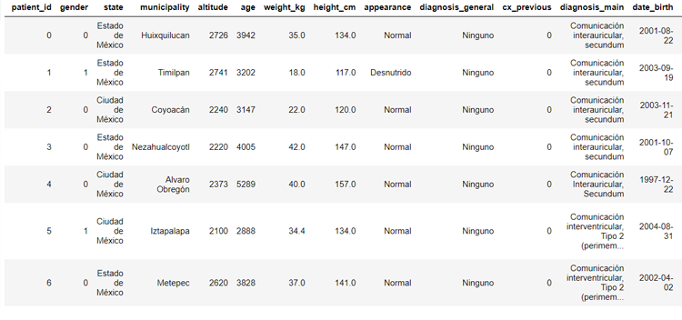
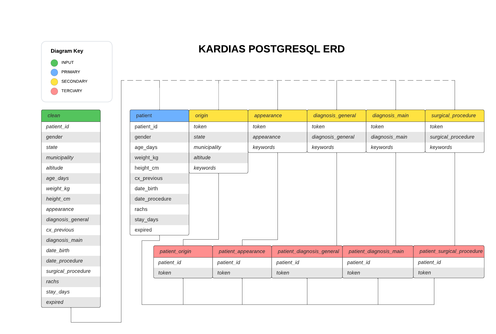
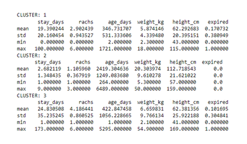

#### *Final Project: Data Analytics 2022*
# Pediatric Cardiopathies from ABC Hospital (Mexico City)

## Reasons for Selected Topic

* The team wants to work in the medical field.
* All members have gained experience on the field recently. 
* The team wanted to engage with real clients and real data. 
* All the members want to work with predictive models that help Kardias inner medical circle to understand data and visualize it.

>Kardias foundation constantly receives donations and financial help
>so final reports could be useful as a decision making tool and data visualization to potential donors.

## Source Data
Kardias Foundation ABC Hospital
* Original Database
Data from pediatric patients with possible cardiopathies in .xlsx file.
Link:  https://github.com/DanielaSotoSainz/final_project/blob/folders/database/database_original.xlsx

Column Name | Example | Type of Data | Number of Rows
------------ | ------------- | ------------- | -------------
masculino=1 | 0 | int64 | 1038
fecha de cirugía | 04/08/2012 | object | 1038
Peso    (kg) | 35.0 | float64 | 1034

* Final Database
Complete .csv file clean and ready for the analysis.
Link:
https://github.com/DanielaSotoSainz/final_project/blob/main/database/clean2/db_patient.csv

Column Name | Example | Type of Data | Number of Rows
------------ | ------------- | ------------- | -------------
Gender | 0 | int32 | 1003
date_procedure | 04/08/2012 | datetime64[ns] | 1003
weight_kg | 35.0 | float64 | 1003

“cleaning” is necessary before doing analysis, visualizations and entering the data in machine learning. The data given by Kardias required multiple changes, some of them involved correcting orthographic errors, grouping repeated data and adding new classifications. 
###### Image 1. Cleaned Dataframe.

## Exploratory Data Analysis:
Link: https://github.com/DanielaSotoSainz/final_project/blob/main/exploration/exploration.ipynb

Result of the Exploration
###### Image 2. Results from Exploratory Data.

## Questions for the Analysis

* Main objective of the project: “More accurate diagnosis, prognosis, and risk assessment”
* The team formulated 2 hypothesis or questions in order to contribute to  the management of the Congenital Heart Diseases Accurate Diagnosis and Risk Assessment (FDA Artificial Intelligence main objectives):
* Questions:
* How can we predict the Intensive Care Stay Days for new patients?
* How can we predict mortality after surgery?

## Machine Learning
Linear Regression 
* Algorithm to make clusters from patients with similar characteristics. 
* The clusters display the following average variables:
* Stay Days
* RACHS-01
* Previous Surgeries
* Age
* Weight 
* Height
* Mortality
* After the dimensionality reduction, the model is able to answer our initial questions and show the relation from Stay Days and RACHS-1.
* The model can be used by medical or administration staff. 

###### Image 3. Clusters.

## Technologies:
* Data Analysis: Excel, Python, Pandas
* Machine Learning: Scikit-learn, TensorFlow, Keras
* Database: PostgreSQL
* Visualization: Tableau, GeoJSON, Plotly, JavaScript
* API: Python, FastAPI

## Teamwork
### Members

* Galo Cázares Fernández
* Alberto Valdez Quinto
* Daniela Soto Sainz

### Roles

* Square: Dany
* Circle: Galo
* Triangle: Beto

### Strategies

1. Communication
* Always be in touch with each member of the team. 
* Technologies for clear communication: Whatsapp, Slack, Github.

2. Organization
* All the team needs to know the rubrics for each deliverable. 
* Write a minute after each reunion. 
* Create checklists.
* The team is aware of the responsibilities of each role.

3. Guidance
* Ask for help, solve doubts with team members or tutors.

### Links

Presentation:

HTML:

